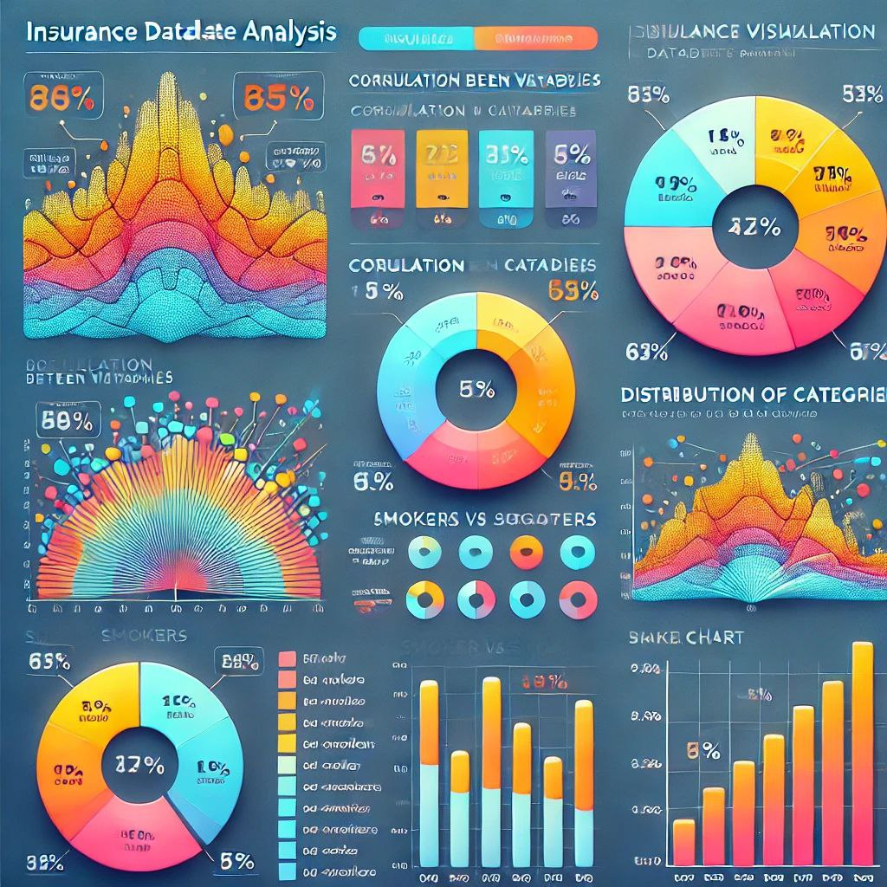

# Data Visualization of Insurance Dataset

This project provides a comprehensive analysis and visualization of an insurance dataset. It includes data cleaning, exploratory data analysis (EDA), and multiple data visualizations to understand patterns and trends.

## Project Structure

1. Library Imports: Importing the necessary libraries, such as Pandas, Matplotlib, and Seaborn.
2. Data Loading: Loading the insurance dataset for analysis.
3. Data Cleaning: Handling missing values, removing outliers, and preparing data for visualization.
4. Exploratory Data Analysis (EDA):
   - Heatmap: Displays correlation between numerical features.
   - Pie Chart: Visualizes the distribution of categories (e.g., smokers/non-smokers).
   - Bar Chart: Shows counts of smokers based on gender.
   - Histogram: Depicts the distribution of numerical variables, such as age.

## Visualizations

To replicate the visualizations, run the notebook from top to bottom. You can use the following code to include an image:
)
